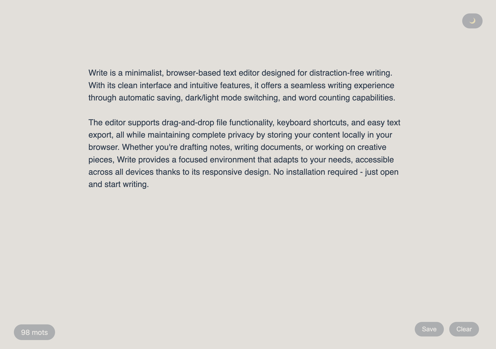

# Write - A Minimalist Text Editor

A clean, distraction-free text editor for the web that focuses on simplicity and ease of use.

## Features

- 🌓 Dark/Light mode toggle
- 💾 Auto-save functionality
- 📝 Word counter
- 📁 Drag & drop file support
- 📱 Responsive design
- ⌨️ Keyboard shortcuts
- 💻 Offline support (works in browser)
- 📥 Export text files

## Keyboard Shortcuts

- `Ctrl/Cmd + S`: Save the current text as a .txt file

## Technical Details

Built with vanilla JavaScript and CSS, no external dependencies required. The editor uses:
- Local Storage for auto-saving
- File API for drag & drop functionality
- CSS Grid and Flexbox for responsive layout
- CSS transitions for smooth theme switching

## Usage

Simply open the HTML file in your browser to start using the editor. Your text will be automatically saved in your browser's local storage.

## Installation

1. Clone this repository:

2. Open `write.html` in your web browser

## Contributing

Feel free to submit issues and enhancement requests!

## License

This project is open source and available under the [MIT License](LICENSE).
